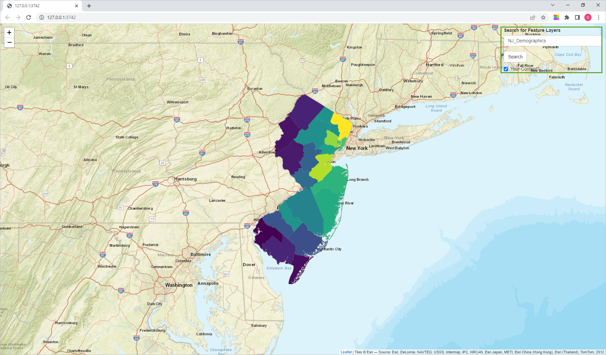
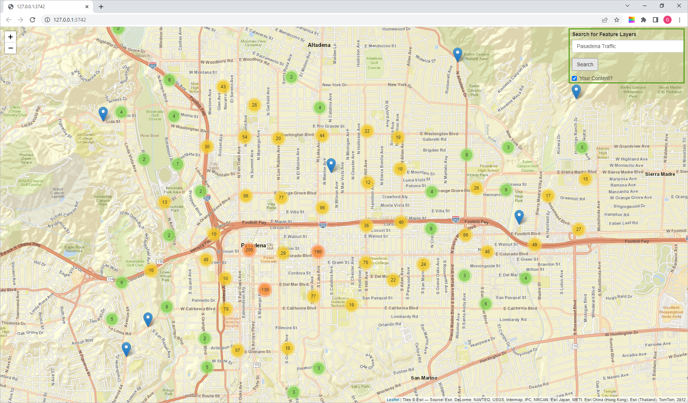
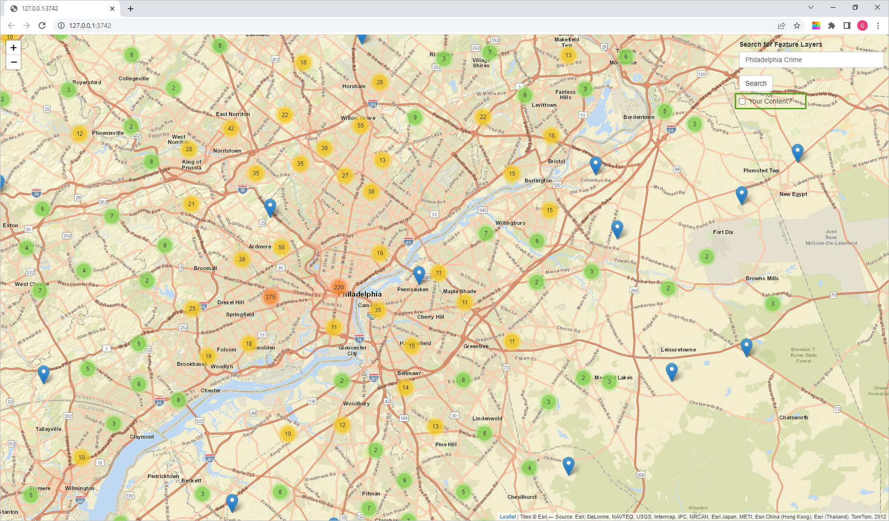

# Shiny Applications
This folder contains sample [Shiny](https://shiny.rstudio.com/) applications that can use ArcGIS Online or ArcGIS Enterprise. You should be able to clone this repo and open up any of the Shiny projects in [RStudio](https://posit.co/download/rstudio-desktop/) and be off and running!

# Samples
Below are decriptions to some sample applications created using Shiny.

## [search-and-display-agol](https://github.com/gbrunner/R-Bridge-Tutorial-Notebooks/blob/master/shiny/search-and-display-agol)
This application searches ArcGIS Online or ArcGIS Enterprise for feature services, reads them as GeoJSON, and adds them to a Leaflet map. The UI contains a label, a search text box, a search button, and a check box for searching only your content or all of AGOL. 
Before you run the application, make sure to update the URL, username, and password in the code. 
```
# Create a new GIS object
gis <- new("GIS",
           url="https://learngis.maps.arcgis.com/",
           username = "gbrunner_LearnGIS",
           password = "####")
```
Also, conider updating the default search term to something other than [**NJ_Demographics**](https://github.com/gbrunner/R-Bridge-Tutorial-Notebooks/blob/master/shiny/search-and-display-agol/app.R#L43).
```
textInput("searchTerm", "Search for Feature Layers", value = "NJ_Demographics",
```
Here are a few screenshots of the application.
### Search Term: NJ Demographics

### Search Term: Pasadena Traffic

### Search Term: Philadelphia Crime

